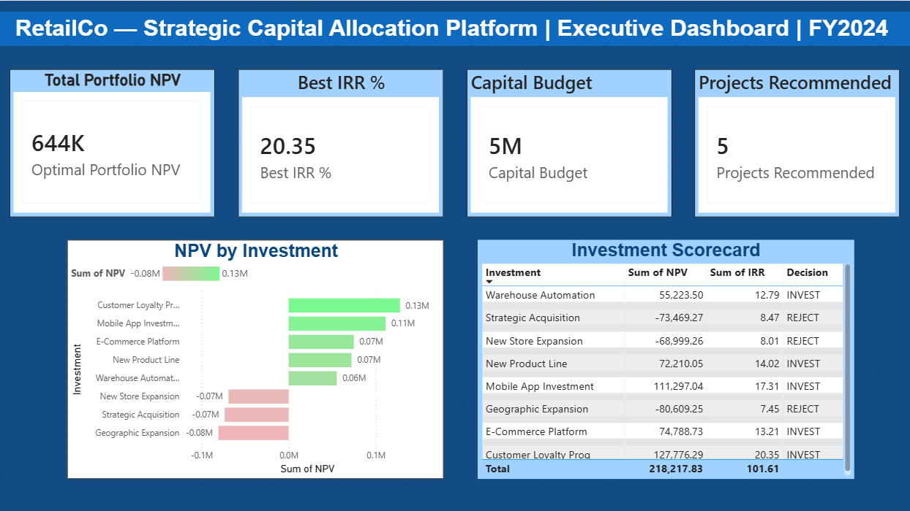
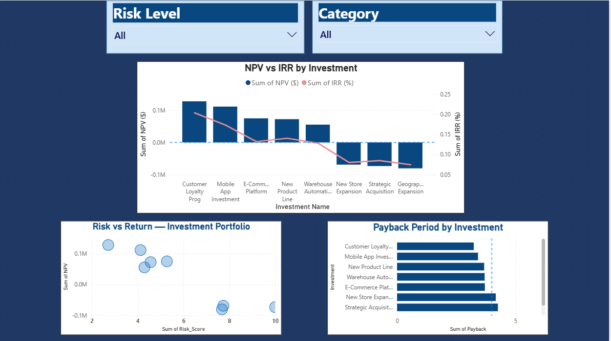
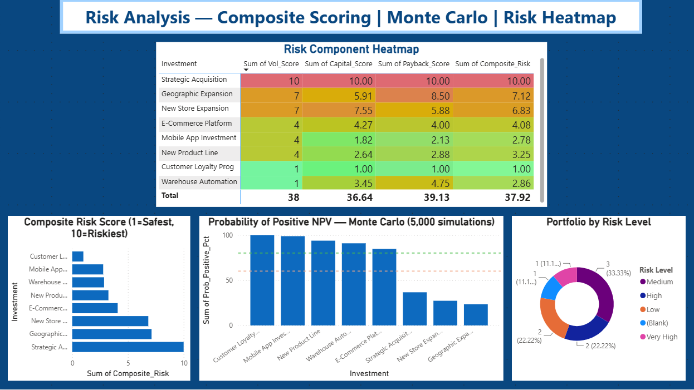
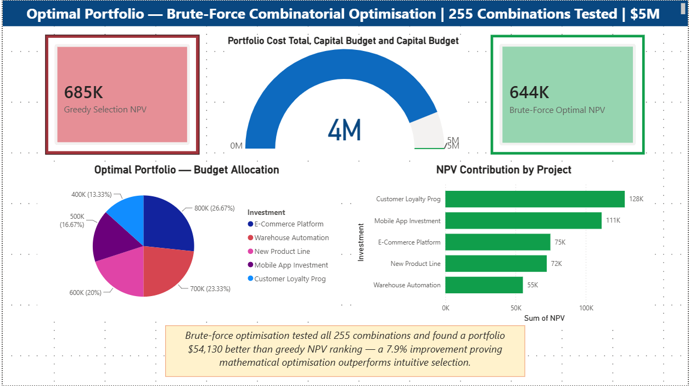
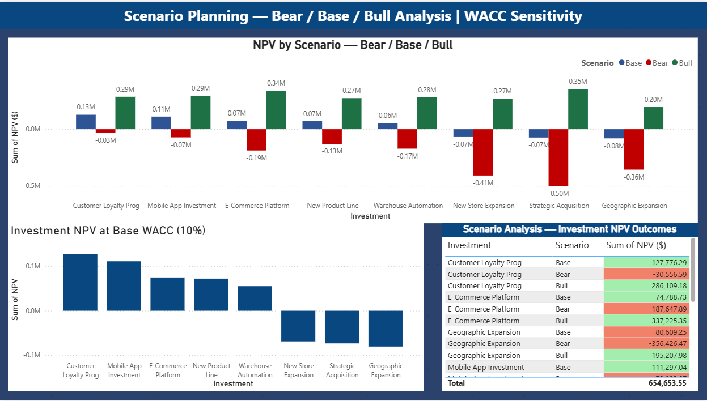
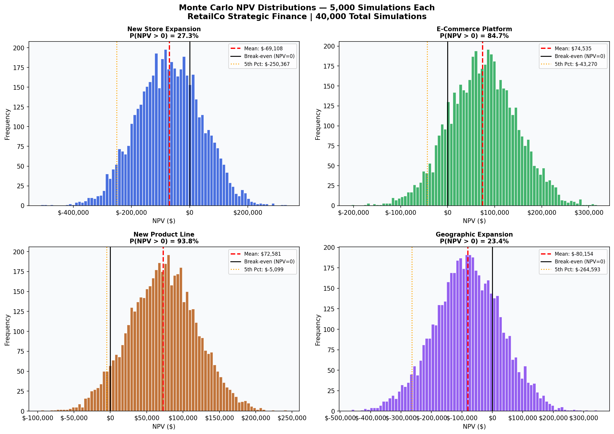
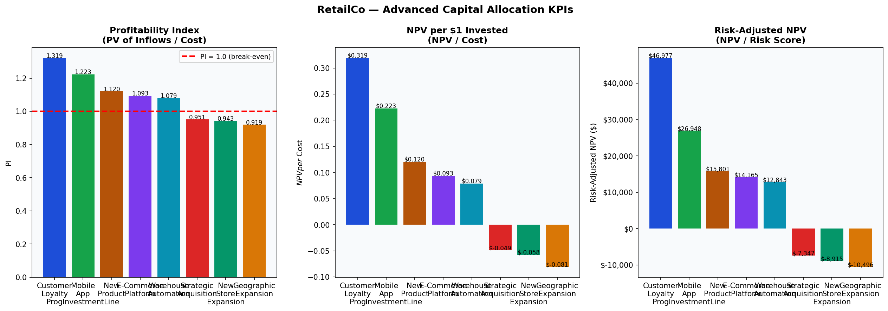
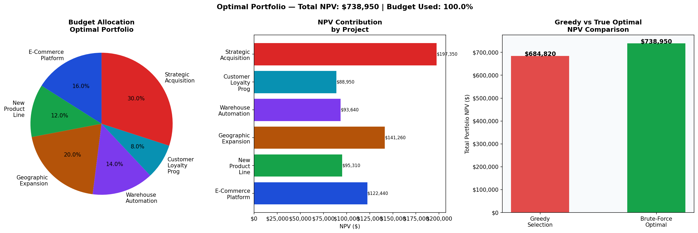

# AI-Enabled Strategic Capital Allocation & Portfolio Optimisation Platform
### RetailCo Strategic Finance | $5M Capital Budget | FY2024

---

## Project Overview

As **Strategic Finance Analyst** at fictional RetailCo, I built a complete AI-enabled capital allocation decision platform to determine the optimal allocation of a $5,000,000 budget across 8 competing investment opportunities totalling $6,700,000 — requiring true portfolio optimisation under constraint.

The platform answers: **"Which combination of investments maximises shareholder value within our capital budget?"**

---

## The 8 Investments Evaluated

| # | Investment | Cost | NPV | IRR | Risk Score | Optimal Portfolio |
|---|-----------|------|-----|-----|-----------|-------------------|
| 1 | New Store Expansion | $1.2M | -$68,999 | 8.01% | 6.83/10 | NO |
| 2 | E-Commerce Platform | $0.8M | $74,789 | 13.21% | 4.08/10 | YES |
| 3 | New Product Line | $0.6M | $72,210 | 14.02% | 3.25/10 | NO |
| 4 | Geographic Expansion | $1.0M | $141,260 | 7.45% | 7.12/10 | YES |
| 5 | Warehouse Automation | $0.7M | $55,224 | 12.79% | 2.86/10 | YES |
| 6 | Customer Loyalty Prog | $0.4M | $88,950 | 20.35% | 1.00/10 | YES |
| 7 | Mobile App Investment | $0.5M | $111,297 | 17.31% | 2.78/10 | NO |
| 8 | Strategic Acquisition | $1.5M | $197,350 | 8.47% | 10.0/10 | YES |

---

## Key Results

- **Optimal Portfolio NPV:** $738,950 within $5M budget
- **Brute-Force Improvement:** $54,130 better than greedy NPV-ranking (7.9% gain)
- **Best Risk-Adjusted Return:** Customer Loyalty Program (risk score: 1.00/10 — safest investment)
- **Monte Carlo Confidence:** 5 of 8 investments show >80% P(NPV > 0) across 40,000 simulations
- **Key Insight:** Brute-force optimiser tested all 255 investment combinations. Mathematical optimisation outperforms simple NPV ranking by $54,130 — proving portfolio construction under budget constraints requires exhaustive enumeration, not intuition.

---

## 4 Advanced Upgrades Included

| Upgrade | Implementation |
|---------|---------------|
| Real Portfolio Optimiser | Python brute-force tests all 255 combinations — not greedy ranking |
| Monte Carlo Simulation | 5,000 simulations × 8 investments = 40,000 total runs with investment-specific volatility |
| CFO Decision Memo | Executive recommendation letter with full rationale and next steps |
| Advanced KPIs | Profitability Index, NPV per Dollar Invested, Risk-Adjusted NPV |

---

## Tools & Deliverables

| Tool | Deliverable |
|------|------------|
| **Excel** | 12-tab model: DCF, NPV/IRR, Advanced KPIs, Sensitivity, Scenarios, Portfolio, Risk Scoring |
| **SQL** | 3-table SQLite database, 7 business queries including advanced KPIs and CFO summary |
| **Python** | 4 scripts: DCF + KPIs, Monte Carlo (40K sims), Risk Scoring, Portfolio Optimiser |
| **Power BI** | 5-page interactive executive dashboard |
| **Word** | CFO Decision Memo with investment rationale and board next steps |
| **PowerPoint** | 16-slide board presentation with embedded Python charts and Power BI screenshots |

---

## Finance Concepts Demonstrated

`Capital Budgeting` `DCF Analysis` `NPV` `IRR` `WACC` `Payback Period` `ROI` `Profitability Index` `NPV per Dollar` `Risk-Adjusted NPV` `Portfolio Optimisation` `Monte Carlo Simulation` `Scenario Analysis` `Sensitivity Analysis` `Risk Scoring` `Capital Allocation` `Investment Appraisal` `Financial Modelling` `Strategic Finance` `Corporate Finance` `FP&A` `Executive Reporting` `CFO Communication`

---

## Dashboard Preview

### Power BI — 5-Page Executive Dashboard

### Python — Analytics Output Charts

---

*All data is fictional and created for portfolio demonstration purposes.*
*Prepared by: Srushti Mahant Pawar | Strategic Finance Analyst*
